#  TAREA FTP

## ÍNDICE

1. [Bloque 8 - Acceso mediante SFTP](#acceso-mediante-sftp)
2. [Bloque 9 - FTPS](#bloque-9---acceso-mediante-sftp)
3. [Bloque 11 - File Browser](#bloque-11---acceso-mediante-sftp)


</br>

## Bloque 8 - Acceso mediante SFTP

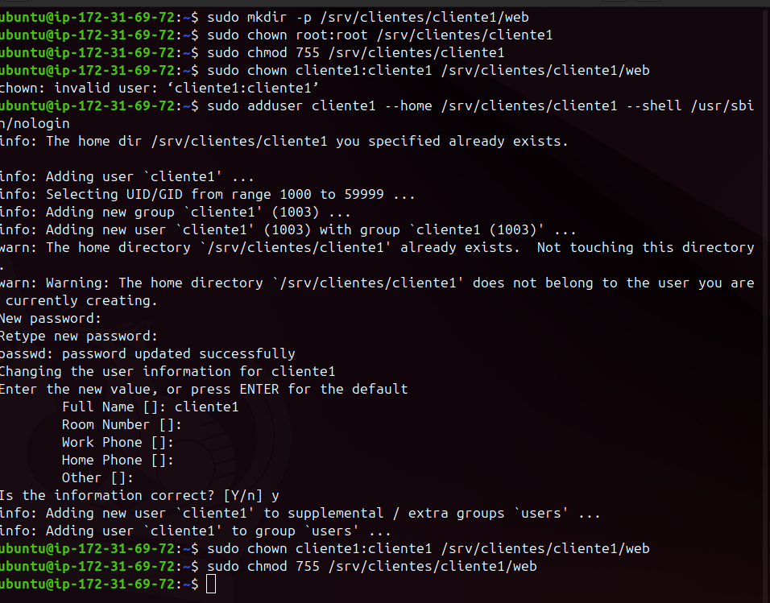


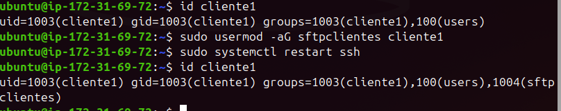

En el cliente:


Dentro del archivo de configuración de ftp:


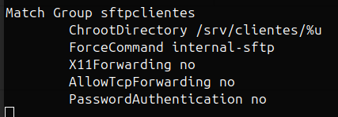

Ejecutamos:

```sh
sudo systemctl restart ssh
```


## Bloque 9 - Acceso mediante SFTP

```sh
sudo apt update
sudo apt install vsftpd -y
```

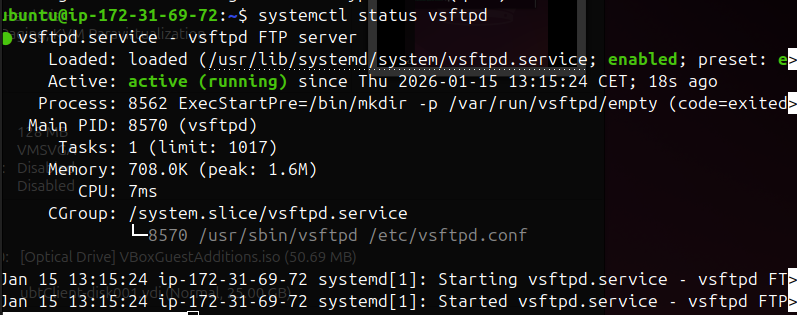


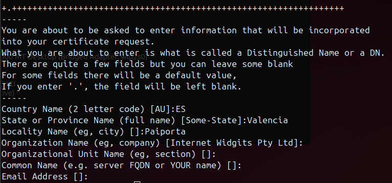

Esto crea:
- Clave privada → vsftpd.key
- Certificado → vsftpd.crt

```sh
sudo cat /etc/ssl/certs/vsftpd.crt /etc/ssl/private/vsftpd.key | sudo tee /etc/ssl/private/vsftpd.pem
```

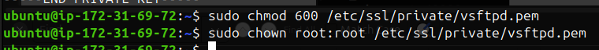

```sh
sudo nano /etc/vsftpd.conf
```


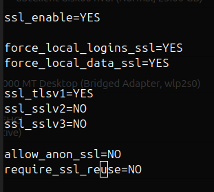

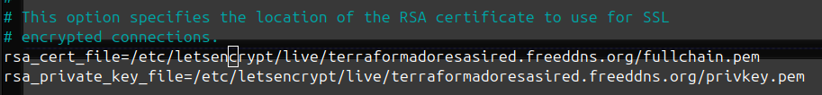

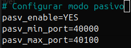


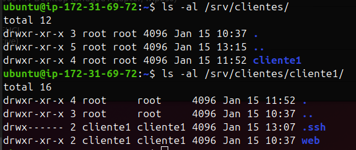

```sh
“sudo systemctl restart vsftpd”
```

Y luego cambiamos reglas firewall aws


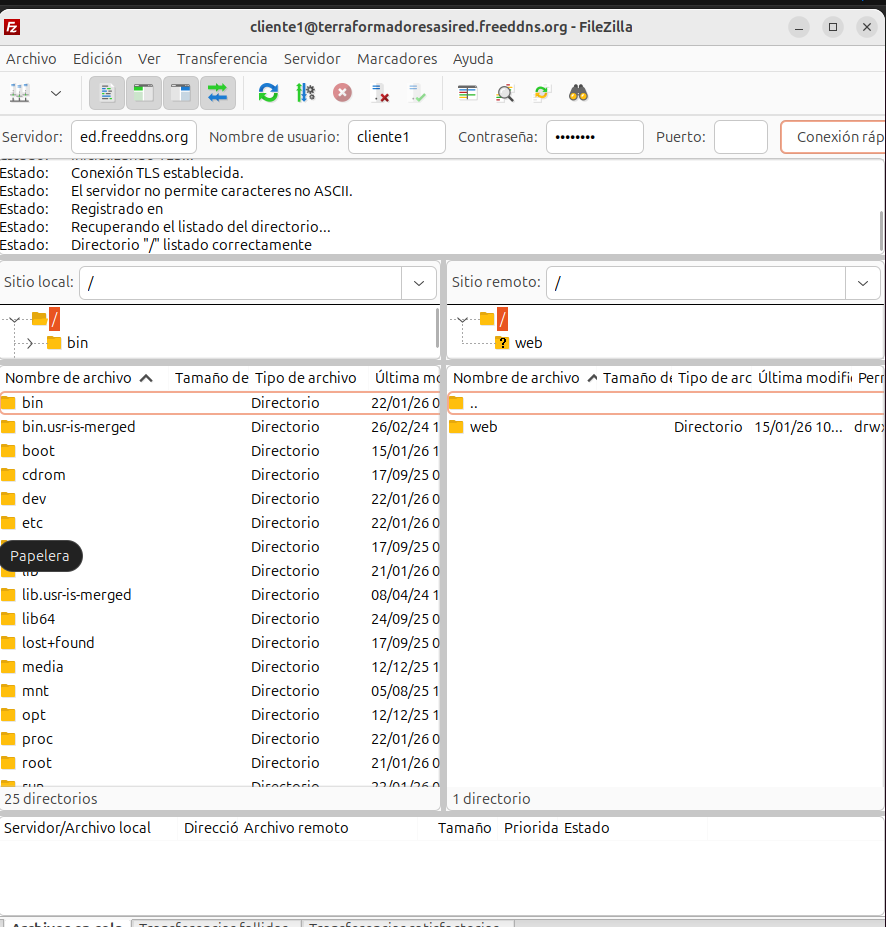


## Bloque 11 - Acceso mediante SFTP

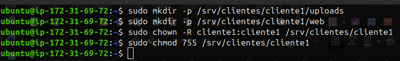


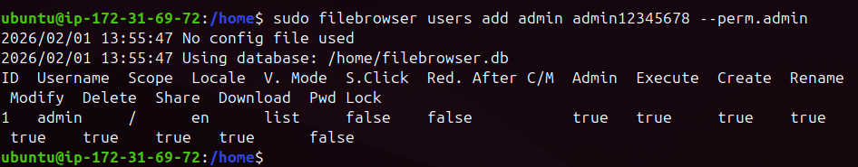

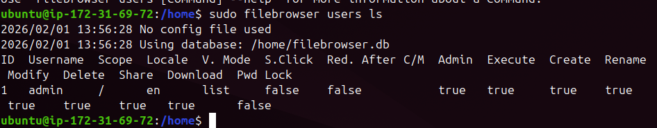


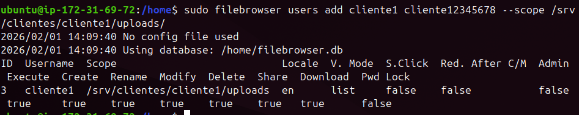


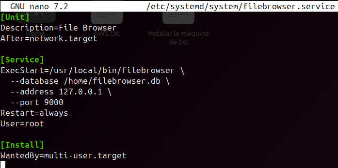


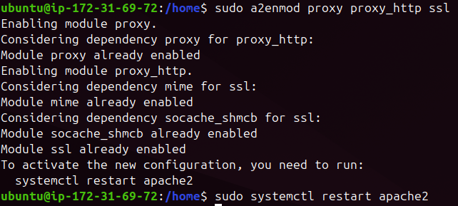


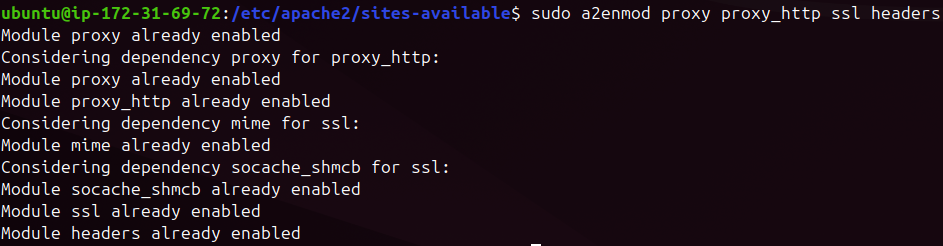


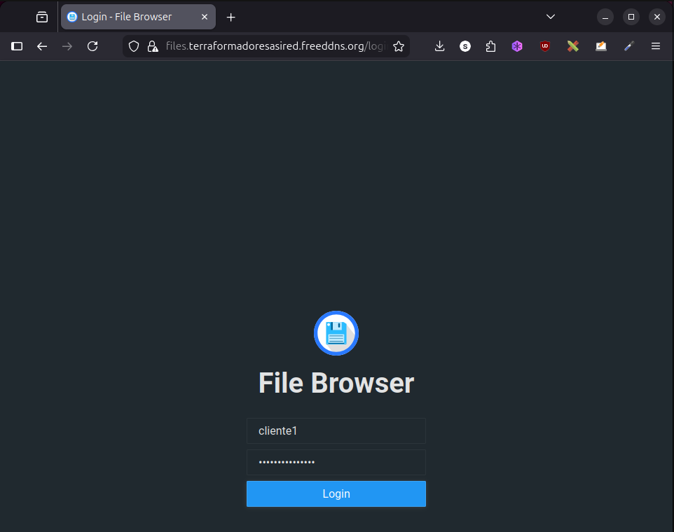

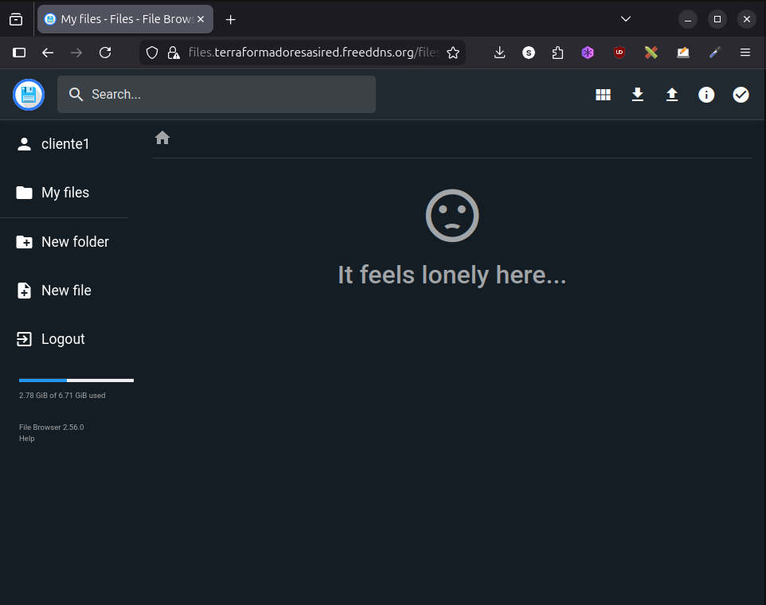


